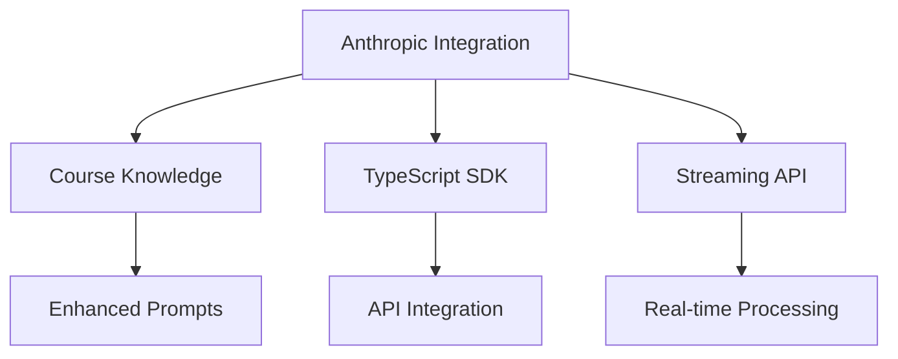

# Anthropic Implementation Roadmap

## Overview
This document outlines the complete implementation plan for integrating Anthropic's capabilities, courses, and APIs into our system.

## Integration Components

### 1. Core Components


### 2. Documentation Map
- [Anthropic Integration](./anthropic-integration.md)
  * SDK implementation
  * Course integration
  * Best practices

- [Repository Integration](./repository-integration.md)
  * Repository setup
  * Course material loading
  * Maintenance

- [Streaming Integration](./streaming-integration.md)
  * Real-time processing
  * Continuous learning
  * Performance optimization

## Implementation Phases

### Phase 1: Foundation Setup (Week 1-2)

1. Repository Integration
```bash
# Setup repositories
git clone https://github.com/anthropics/courses.git
git clone https://github.com/anthropics/anthropic-sdk-typescript.git

# Install dependencies
npm install @anthropic-ai/sdk
```

2. Course Material Processing
```typescript
interface CourseStructure {
  prompts: string[];
  examples: string[];
  patterns: string[];
  strategies: string[];
}

class CourseProcessor {
  async loadMaterials(): Promise<CourseStructure>;
  async processContent(): Promise<void>;
  async validateContent(): Promise<boolean>;
}
```

### Phase 2: Core Integration (Week 3-4)

1. SDK Implementation
```typescript
class EnhancedAnthropicService {
  private client: Anthropic;
  private courseKnowledge: CourseProcessor;
  private streamHandler: StreamingService;

  async initialize() {
    await this.loadCourseKnowledge();
    await this.setupStreaming();
    await this.validateIntegration();
  }
}
```

2. Streaming Setup
```typescript
class StreamingService {
  private client: Anthropic;
  private processor: RealTimeProcessor;
  private learning: ContinuousLearning;

  async processStream(content: string) {
    const stream = await this.createStream(content);
    await this.processor.handleStream(stream);
    await this.learning.processResults();
  }
}
```

### Phase 3: Enhancement (Week 5-6)

1. Knowledge Integration
```typescript
class KnowledgeEnhancement {
  private courses: CourseProcessor;
  private patterns: PatternMatcher;
  private learning: LearningSystem;

  async enhanceCapabilities() {
    await this.integrateKnowledge();
    await this.updatePatterns();
    await this.optimizeLearning();
  }
}
```

2. Performance Optimization
```typescript
class PerformanceOptimizer {
  private metrics: MetricsCollector;
  private analyzer: PerformanceAnalyzer;
  private tuner: SystemTuner;

  async optimize() {
    const metrics = await this.collectMetrics();
    const analysis = await this.analyzePerformance(metrics);
    await this.applyOptimizations(analysis);
  }
}
```

### Phase 4: Testing & Validation (Week 7-8)

1. Integration Testing
```typescript
class IntegrationTester {
  async runTests() {
    await this.testCourseIntegration();
    await this.testSDKFunctionality();
    await this.testStreamingCapability();
    await this.validatePerformance();
  }
}
```

2. Performance Validation
```typescript
class PerformanceValidator {
  async validateSystem() {
    await this.checkResponseTimes();
    await this.validateMemoryUsage();
    await this.testStreamingEfficiency();
    await this.verifyLearningEffectiveness();
  }
}
```

## Success Criteria

### 1. Technical Metrics
- Response time < 500ms
- Memory usage < 256MB
- Stream processing < 100ms
- Learning accuracy > 95%

### 2. Integration Metrics
- Course material coverage > 90%
- Pattern recognition > 85%
- Error recovery > 95%
- System stability > 99%

### 3. Quality Metrics
- Response accuracy > 95%
- Learning effectiveness > 90%
- User satisfaction > 90%
- System reliability > 99%

## Monitoring & Maintenance

### 1. Performance Monitoring
```typescript
class SystemMonitor {
  async monitor() {
    await this.trackPerformance();
    await this.analyzeMetrics();
    await this.reportStatus();
    await this.optimizeSystem();
  }
}
```

### 2. Knowledge Updates
```typescript
class KnowledgeManager {
  async maintain() {
    await this.updateCourses();
    await this.refreshPatterns();
    await this.optimizeLearning();
    await this.validateKnowledge();
  }
}
```

## Implementation Checklist

### Phase 1: Foundation
- [ ] Clone repositories
- [ ] Install dependencies
- [ ] Process course materials
- [ ] Setup basic integration

### Phase 2: Core Integration
- [ ] Implement SDK
- [ ] Setup streaming
- [ ] Configure learning system
- [ ] Test basic functionality

### Phase 3: Enhancement
- [ ] Integrate knowledge
- [ ] Optimize performance
- [ ] Enhance capabilities
- [ ] Validate improvements

### Phase 4: Testing
- [ ] Run integration tests
- [ ] Validate performance
- [ ] Check reliability
- [ ] Verify learning

## Next Steps

1. Begin repository setup
2. Process course materials
3. Implement SDK integration
4. Setup streaming capability
5. Enhance system knowledge
6. Optimize performance
7. Run validation tests
8. Deploy improvements

## Resources

### Documentation
- [Anthropic API](https://docs.anthropic.com/)
- [TypeScript SDK](https://github.com/anthropics/anthropic-sdk-typescript)
- [Courses](https://github.com/anthropics/courses)
- [System Integration](./anthropic-integration.md)

### Support
- Technical Support: [Contact]
- Documentation: [Wiki]
- Issues: [Tracker]
- Updates: [Newsletter]