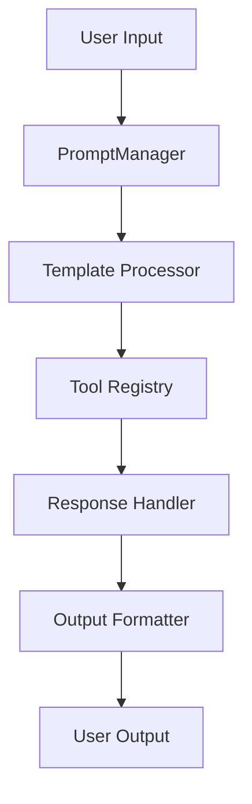
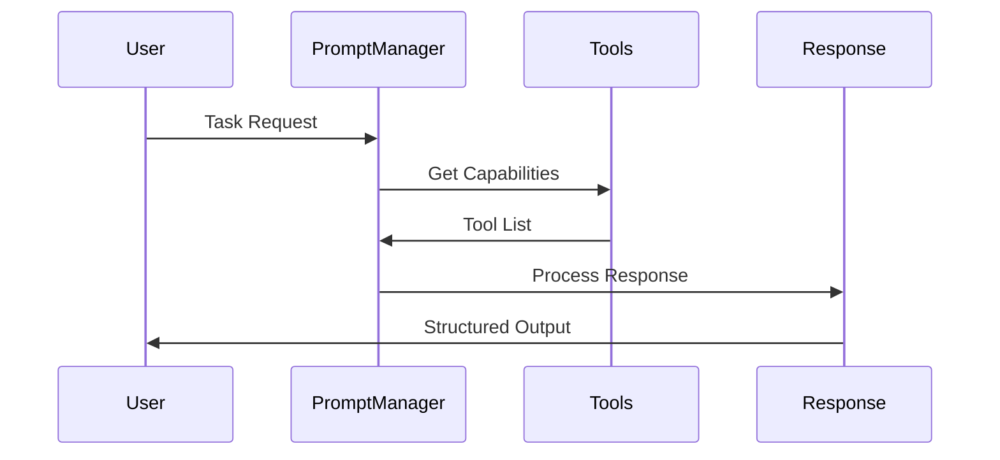

# Enhanced Prompt System Overview

## Documentation Map

### 1. Architecture and Design
- [Architecture Decision Record](./adr/004-enhanced-prompt-system.md)
  * Core architecture decisions
  * System components
  * Technical implementation
  * Validation strategy

- [Prompt Templates](./prompt-templates.md)
  * System prompt structure
  * Example implementations
  * Template variables
  * Usage guidelines

### 2. Implementation and Testing
- [Testing Strategy](./prompt-testing.md)
  * Test categories
  * Validation criteria
  * Test scenarios
  * Quality metrics

- [Migration Guide](./prompt-migration.md)
  * Migration phases
  * Implementation steps
  * Rollback procedures
  * Success criteria

## Key Components

### 1. Enhanced Prompt Structure
```
System Prompt
├── System Capabilities
│   ├── Available Tools
│   ├── Limitations
│   └── Permissions
├── Task Processing
│   ├── Inner Monologue
│   ├── Action Planning
│   └── Execution Steps
└── Output Format
    ├── Task Completion
    ├── Status Report
    └── Reflection
```

### 2. Response Processing
```
Structured Response
├── Inner Monologue
│   ├── Task Analysis
│   ├── Required Actions
│   ├── Action Sequence
│   └── Considerations
├── Action Execution
│   ├── Action Description
│   └── Action Result
└── Task Completion
    ├── Summary
    ├── Details
    └── Status
```

## Implementation Strategy

### Phase 1: Foundation
1. Documentation and Design
   - System architecture
   - Component interfaces
   - Testing strategy
   - Migration plan

2. Core Components
   - Enhanced PromptManager
   - Response processor
   - Validation system
   - Monitoring tools

### Phase 2: Development
1. Template System
   - Variable injection
   - Format validation
   - Error handling
   - Response parsing

2. Tool Integration
   - Capability documentation
   - Runtime validation
   - Error recovery
   - Performance monitoring

### Phase 3: Testing
1. Validation Framework
   - Unit tests
   - Integration tests
   - Performance tests
   - User acceptance

2. Quality Assurance
   - Response validation
   - Error handling
   - Performance metrics
   - User feedback

### Phase 4: Deployment
1. Rollout Strategy
   - Feature flags
   - A/B testing
   - Monitoring
   - User support

2. Optimization
   - Performance tuning
   - Memory usage
   - Response quality
   - Error recovery

## Success Metrics

### 1. Technical Performance
- Response time < 500ms
- Memory usage < 256MB
- CPU usage < 30%
- Error rate < 1%

### 2. Quality Metrics
- Task completion rate > 95%
- Response accuracy > 98%
- Error recovery rate > 90%
- User satisfaction > 90%

## System Integration

### 1. Component Interaction


### 2. Data Flow


## Monitoring and Maintenance

### 1. Performance Monitoring
- Response times
- Resource usage
- Error rates
- System health

### 2. Quality Assurance
- Response validation
- Error tracking
- User feedback
- System improvements

## Future Enhancements

### 1. Planned Improvements
- Enhanced error recovery
- Advanced task planning
- Improved response quality
- Performance optimization

### 2. Research Areas
- Context awareness
- Learning capabilities
- Adaptive responses
- Multi-step planning

## Getting Started

### 1. Development Setup
```bash
# Install dependencies
npm install

# Run tests
npm test

# Start development server
npm run dev
```

### 2. Usage Example
```typescript
// Initialize prompt system
const promptManager = new EnhancedPromptManager();
const response = await promptManager.processTask(userInput);

// Handle response
if (response.status === 'Success') {
  console.log(response.summary);
} else {
  console.error(response.error);
}
```

## Support and Resources

### 1. Documentation
- System architecture
- API reference
- Best practices
- Troubleshooting

### 2. Development Tools
- Test suites
- Debugging tools
- Performance profilers
- Monitoring dashboards

## Next Steps

1. Review architecture documentation
2. Set up development environment
3. Run test suites
4. Start implementation
5. Monitor performance
6. Gather feedback
7. Optimize system
8. Deploy to production

## Contact

For questions or support:
- Technical Lead: [Name]
- Support Team: [Email]
- Documentation: [Wiki]
- Issue Tracker: [Link]